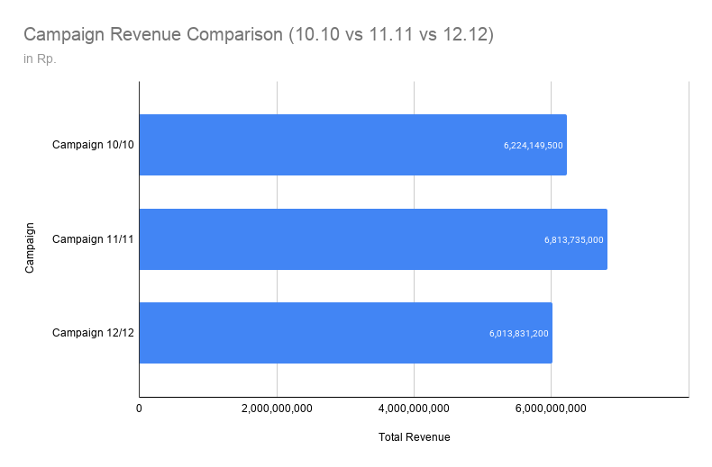
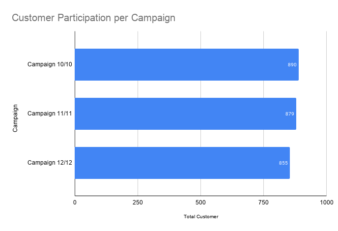

# Tokobli Campaign Analysis
## Campaign performance analysis and customer behavior evaluation
## SECTION 1: PROJECT SUMMARY FOR PORTFOLIO
### Summary/Context
This analysis evaluates marketing campaign effectiveness and customer purchasing behavior for TokoBli, an e-commerce platform. By examining data from three major sales events—10/10, 11/11, and 12/12—the project seeks to identify optimal strategies for increasing revenue and budget efficiency. The project provides a foundation for data-driven budget allocation and marketing optimization.

### Goals
The primary goal is to determine which campaign (10/10, 11/11, or 12/12) most effectively maximizes total revenue and budget efficiency while acquiring new customers. Additionally, the project aims to identify relevant business metrics, such as revenue-to-budget ratios, to objectively assess performance results and provide strategic recommendations for future promotional budget allocation.

### Process
The process began with data cleaning, including removing 5 duplicate records and handling missing values in the transaction, status, and price columns. Descriptive analytics and outlier removal were performed using XL Miner and the IQR method. Finally, Exploratory Data Analysis (EDA) and t-test hypothesis testing were conducted to evaluate campaign performance.

### Output 
The 12/12 campaign was the most efficient, generating Rp 54.90 in revenue for every Rp 1 spent on discounts. Analysis showed no significant difference in Wine revenue between campaigns. We recommend optimizing future campaigns through targeted discounts, personalized promotions, and bundling offers for high-value products to maintain healthy profit margins while expanding the active customer base. This analysis provides actionable insights to improve campaign efficiency and optimize marketing budget allocation.

## SECTION 2: SCOPE OF WORK / ACHIEVEMENTS (AQS FRAMEWORK)
- Analyzed 4,208 transactions and 5,425 products sold to identify the most efficient campaign strategies for TokoBli.
- Cleaned the dataset by removing 5 duplicate records and 4,187 blank status rows to ensure data integrity.
- Performed outlier removal using the 1.5 IQR method, resulting in a final dataset of 4,198 unique rows.
- Conducted hypothesis testing using a t-test with a 5% significance level to validate campaign revenue performance claims.

## SECTION 3: TOOLS & METHODS
### A. Tools
- Excel/Google Sheets (Ribbon menus, Filter, Format)
- XL Miner 
- PivotTable (Calculated Fields, PivotTable Analyze)
  
### B. Methods 
- Data Cleaning (Duplicate removal, handling missing values) 
- Descriptive Analytics (Mean, Median, Mode, Standard Deviation, Skewness) 
- Outlier Removal (IQR method, Inner Fence) 
- Exploratory Data Analysis (EDA) 
- Hypothesis Testing (t-test for two samples assuming unequal variances) 
- Correlation Analysis (Revenue-to-Discount Ratio)
  
### Dataset Source:  
https://docs.google.com/spreadsheets/d/1vONURn49kp-Gr2PrqP7_XeKTAkxmREsZilFLjGv4cRU/edit

## SECTION 4: VISUAL SUGGESTIONS
- *Data Cleaning Flow*: A visual summary showing the reduction from 4,213 rows to 4,198 rows after removing duplicates and outliers.
- *Descriptive Statistics Summary*: A table or chart displaying the distribution of QTY and Discount values, highlighting the right-skewed nature of the data.
- *Campaign Performance Bar Chart*: A bar chart comparing total transactions, customers, products sold, revenue, and discount budgets across the three periods.
- *Efficiency Comparison Chart*: A visual representing the "Ratio on Revenue to Discount," specifically highlighting the Rp 54.90 efficiency of the 12/12 campaign.
- *Product Category Matrix*: A breakdown of top-performing product categories (like Men’s Fashion and Home & Living) versus their discount levels.

## Key Visualizations

### Campaign Revenue Comparison

### Customer Participation per Campaign

### Insights Visualization
- The 11.11 campaign generated the highest revenue (Rp 6.81B) despite having slightly fewer customers than the 10.10 campaign.
- Customer participation across campaigns remained relatively stable, ranging from 855 to 890 users.
- Revenue differences are likely driven by higher spending per customer during the 11.11 campaign.
- The 12.12 campaign showed a decline in both customer participation and revenue, indicating potential campaign fatigue or less effective promotional strategies.

  ## Key Insights
- Campaign performance varies across periods and product categories.
- Revenue is driven by specific customer segments.
- Discount strategy impacts purchasing behavior.
- Targeted promotions can improve campaign effectiveness.

## Business Recommendations
- Prioritize the 11.11 campaign as the primary promotional event since it generates the highest revenue among all campaigns.
- Increase marketing investment and promotional activities leading up to the 11.11 campaign to maximize revenue potential.
- Improve conversion rates during the 12.12 campaign by offering targeted discounts and personalized recommendations.
- Develop retention strategies to encourage repeat purchases from customers participating in major campaign events.

## Project Files
tokobli-campaign-analysis
│
├── README.md
├── Tokobli-Campaign-Analysis-1.pdf
├── Tokobli_Campaign_Analysis_dataset.csv
├── campaign_customers.png
└── campaign_revenue.png

  ## Author
  Venny Amilia Deslaweny
